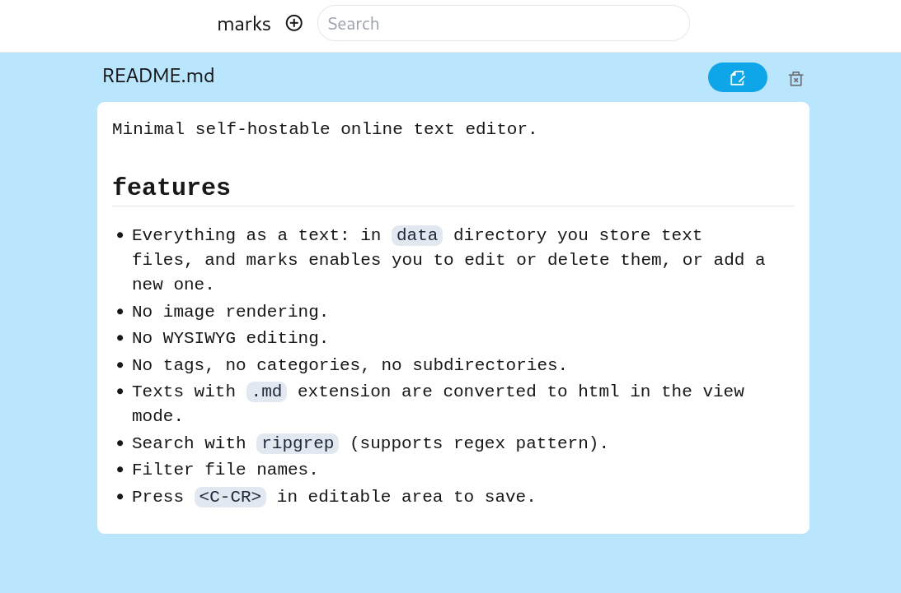

# marks
Minimal self-hostable online text editor.

## features
- Everything as a text: in `data` directory you store text files, and marks enables you to edit or delete them, or add a new one.
- No image rendering.
- No WYSIWYG editing.
- No tags, no categories, no subdirectories.
- Texts with `.md` extension are converted to html in the view mode.
- Search with `ripgrep` (supports regex pattern).
- Filter file names.
- Press `<C-CR>` in editable area to save.

## deploy
`sudo docker run -d -v /path/to/data:/marks/data --name marks -p 8080:8080 kyoheiudev/marks:0.2.5`
